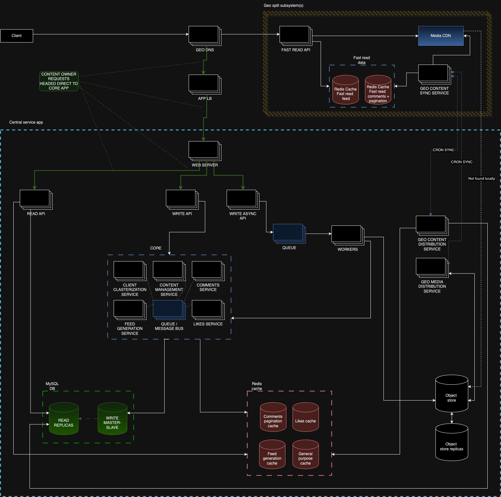

# hsa-proto-instagram-model
HSA homework 6 - model of simplified instagram

# Task
Choose proper architecture pattern for Instagram services.

Find what will be bottleneck in each case.

Find what might be a SPOF in each case.

We analyse just news feed that contains video and photos.

We interested only in likes and comments functionality.

# Design the Instagram feed, comments and likes

## Step 1: Outline use cases and constraints

> Gather requirements and scope the problem.
> Ask questions to clarify use cases and constraints.
> Discuss assumptions.

Without an interviewer to address clarifying questions, we'll define some use cases and constraints.

### Use cases

#### We'll scope the problem to handle only the following use cases

* **User** create post (with videos and/or photos)
    * **Service** distributes created post (feed item) to corresponding auditory (based on their subscriptions etc.) 
* **User** views feed that consist of similar posts, according to his interests/subscriptions
* **User** comments another post
  * **User** comments another post as reply to top-level comment 
  * **User** removes own comments/replies
* **User** likes/dislikes another post/comment
  * **User** sees total likes counter for each feed item/comment/reply 
* **Service** has high availability

#### Out of scope

* **Service** use complex statistics/analytics to create groups of interests/subscriptions for each **User**

### Constraints and assumptions

#### State assumptions

General

* Traffic is not evenly distributed
* Posting a feed post should be fast
    * Distribution of created feed post to all of your subscribers should be fast enough, but 10-15 mins delay is assumed as OK
* 1.6+ billion active users
* Followers stats
  * 26.43% of users have less than 1,000 followers
  * 49.94% of users have between 1,000 to 10,000 followers
  * 15.21% of users have between 10,000 to 50,000 followers
  * 3.15% of users have between 50,000 to 100,000 followers
  * 3.89% of users have between 100,000 to 500,000 followers
  * 0.62% of users have between 500,000 and 1 million followers
  * 0.76 of users have more than 1 million followers

Feed posts / content

* Creating the post should be fast
* Instagram read heavy to write heavy ratio supposed to be equal or 60/40 at max 
    * Optimize for fast reads of feed content with possible content update delays
    * Optimize for fast editing/managing content
* Media content should be optimized

## Step 2: Create a high level design

> Outline a high level design with all important components.

### Important notes
1. System has several separated by geo subsystems, designed for content presenting;
   1. Geo split is done by Geo DNS
2. Content owner requests (create/edit post/comment) and like/dislike action are propagated directly to service app
3. Upon service app there are 
   1. load balancer
   2. read api
   3. write api
   4. write async api
   5. MySQL DB (master-slave with replication)
   6. Redis caches (separate for important domain entities)
   7. Object store (stores media files, has replicas/back-ups as well)
   8. Queue service and corresponding workers
4. Also at service app level present 2 services for interacting with geo split subsystems
   1. Geo media distribution service - periodically fetch objects from object store and return them to geo subsystem to be stored in CDN
   2. Geo content distribution service - periodically fetch prepared content items and return them to geo subsystem to be stored in fast read cache
5. Core of the system presented by services
   1. Content management service (CRUDs for feed posts creation, commenting)
   2. Comments service (managing comments/replies pagination, filtering)
   3. Likes service (managing likes/dislikes relations, counter aggregation)
   4. Client clustering service (use of collaborative filtering to create appropriate subscriptions/recommendations lists for each valuable user group)
   5. Feed generation service (consuming client clustering info - prepare feed chunks of certain length for each provided user group)
   6. All this services communicate with each other via separate queues (as message bus; RabbitMQ or Kafka)
6. Each typical geo subsystem presented by services
   1. Fast read api (read data from cache storage and media from CDN and return it to client)
   2. Fast read cache (stores prepared for presenting feed posts/comments+replies/likes metadata)
   3. Content sync service (sync content from central service app by scheduled cron task; syncs prepared feed lists for each user group, with comments/likes included - store to local redis cache)

## Step 3: Design core components

> Dive into details for each core component.

### Use case: User creates feed post

* The **Client** makes a request to post feed item, request propagated via **GeoDNS** -> **Load balancer** to central service app
  * Static post values (texts, metadata etc) stored via **Write API** -> **Content management service**
  * Media files stored via async workers to **Object storage**
* **Client clustering service** receives "feed post created" trigger
* **Feed generation service** interacts with **Client clustering service** and create "targets lists" for newly created feed post to be delivered to
* **Feed generation service** stores/refreshes feed lists in DBs and core redis caches
* After next scheduled cron task each **Geo split subsystem** -> **Geo content sync service** requests from
  * **Geo content distribution service** updated feed lists (according to user groups existing in certain geo) with comments/replies/likes data included
  * **Geo media distribution service** media objects from object storage to be stored in geo CDN

### Use case: User leaves comment/reply

* The **Client** makes a request to create comment, request propagated via **GeoDNS** -> **Load balancer** to central service app
  * stored via **Write API** -> **Comments service**
* **Clustering service** receives "content item was commented" trigger and recalculates user groups info if needed
* **Comments service** stores/refreshes exact feed post item in DBs and core redis caches with relation of newly added comment
* After next scheduled cron task each **Geo split subsystem** -> **Geo content sync service** requests from
  * **Geo content distribution service** updated feed lists (according to user groups existing in certain geo) with comments/replies/likes data included - in this case comments data will contain new comment/reply

### Use case: User likes/dislikes content item

* The **Client** makes a request to make like/dislike action, request propagated via **GeoDNS** -> **Load balancer** to central service app
  * stored via **Write API** -> **Likes service**
* **Clustering service** receives "content item was liked" trigger and recalculates user groups info if needed
* **Likes service** stores exact content item in DBs and core redis caches with relation of newly added/removed like, carries out aggregation to update item`s metadata 
* After next scheduled cron task each **Geo split subsystem** -> **Geo content sync service** requests from
  * **Geo content distribution** service updated feed lists (according to user groups existing in certain geo) with comments/replies/likes data included - in this case comments data will contain new likes metadata for certain items (posts, comments/replies)

### Use case: User requests feed

* The **Client** makes a request to get feed lists, request propagated via **GeoDNS** -> to **Geo split subsystem**
* **Fast read API** collects data from geo local caches, make some additional preparations, return them to **Client**
* Media data related to returned feed contents accessed via **GeoDNS** -> to **Geo split subsystem** -> **Media CDN** (if not found - request to central service app storage, edge case)

## Step 4: Scale the design

> Identify and address bottlenecks, given the constraints.

### Bottlenecks & single point of failure (SOPF)

#### Use case: User creates feed post
In this use case bottlenecks are:
* Load balancer before central service app (failure of this load balancer will make inaccessible our core logic)
* **Client clustering service** + **Feed generation service** (both of these services carrying out heavy calculations and are critical for creating feed lists)

#### Use case: User leaves comment/reply
In this use case bottlenecks are:
* Load balancer before central service app (failure of this load balancer will make inaccessible our core logic)
* **Client clustering service** + **Feed generation service** (both of these services carrying out heavy calculations and are critical for creating feed lists)
* **Comment service** (failure of this service will make inaccessible comments managing logic)

#### Use case: User likes/dislikes content item
In this use case bottlenecks are:
* Load balancer before central service app (failure of this load balancer will make inaccessible our core logic)
* **Client clustering service** + **Feed generation service** (both of these services carrying out heavy calculations and are critical for creating feed lists)
* **Likes service** (failure of this service will make inaccessible likes managing logic)

#### Use case: User requests feed
In this use case bottlenecks are:
* Load balancer before central service app (failure of this load balancer will make inaccessible our core logic)
* **Fast read API service** 
* **Media CDN** (failure will drastically increase load on core **Object store**)
* **Likes service** (failure of this service will make inaccessible likes managing logic)
* **Geo content sync service** + **Geo content distribution service** - failure of one member of this pair will make either outdated one geo split subsystem or all of them 

#### Bottlenecks summary

Analyzing bottlenecks for each use case we can sum up next points, and actually we can call them a single point of failure:
* Load balancer before central service app
* Pair **Client clustering service** + **Feed generation service**
* Pair **Geo content sync service** + **Geo content distribution service**
* Queues service provider
* Redis storage in central service app
* Redis storage in **Geo split subsystem**
* MySQL DB in central service app

### Improvement propositions
* Add more load balancers before central service app (horizontal scaling)
* Add more read replicas for MySQL DBs and for redis storages (redis clusters)
* Move pair **Client clustering service** + **Feed generation service** to separate logical env, to make possible separate load monitoring and horizontal scaling
* Increase number of instances of **Geo content distribution service** in central service app
* Vertical scaling of queues service provider (also use quorum queues for RabbitMQ)
* All separate service on the diagram should mean that it is N+1 servers (instances) after its own load balancer or consuming from one message bus / queue, so any of them can horizontally scale

